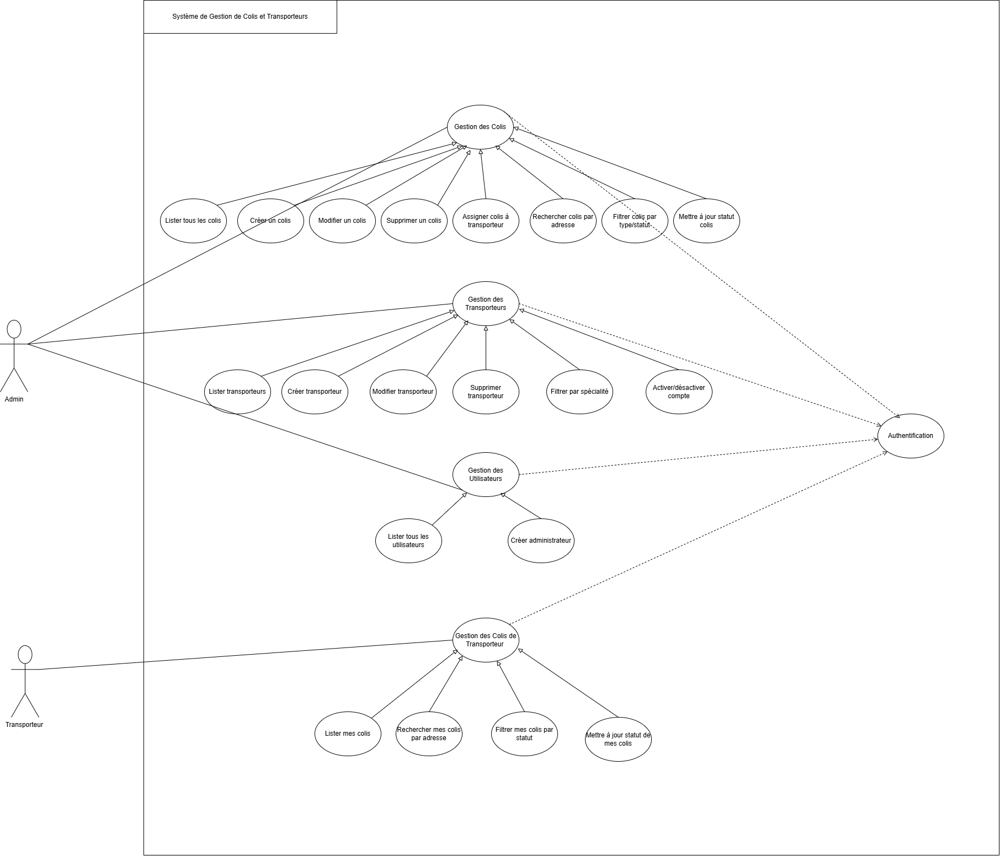
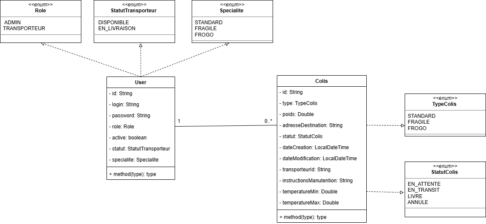

# 📦 LOGISTIX – Système de Gestion de Colis et Transporteurs

<div align="center">


**API REST sécurisée pour la gestion des colis et des transporteurs, basée sur une architecture moderne Spring Boot & MongoDB**

</div>

---

## 📖 Contexte du Projet

LOGISTIX est une API REST développée pour une entreprise de logistique souhaitant moderniser son système de gestion des colis.  
L’application permet de gérer différents types de colis (**STANDARD, FRAGILE, FRIGO**) avec des règles métier spécifiques, ainsi que des utilisateurs avec rôles (**ADMIN, TRANSPORTEUR**) via une **authentification stateless JWT**.

L’architecture exploite le **schéma flexible de MongoDB**, intègre les **bonnes pratiques Spring**, et adopte une approche **DevOps** avec Docker et CI/CD.

---

## 🌟 Fonctionnalités

### 🔐 Sécurité & Authentification
- Authentification **stateless JWT**
- Gestion des rôles : **ADMIN / TRANSPORTEUR**
- Accès sécurisé aux endpoints selon le rôle
- Désactivation / réactivation des comptes utilisateurs
- Stockage sécurisé des rôles dans le token JWT

### 📦 Gestion des Colis
- Création de colis (**ADMIN uniquement**)
- Types de colis :
  - **STANDARD** : poids, adresse, statut
  - **FRAGILE** : + instructions de manutention
  - **FRIGO** : + température min / max
- Assignation d’un colis à un transporteur selon sa spécialité
- Mise à jour du statut du colis
- Suppression de colis (**ADMIN uniquement**)
- Recherche par adresse destination
- Pagination et filtres par type et statut

### 🚚 Gestion des Transporteurs
- Création / modification / suppression de transporteurs (**ADMIN**)
- Filtrage par spécialité :
  - STANDARD
  - FRAGILE
  - FRIGO
- Suivi du statut :
  - DISPONIBLE
  - EN_LIVRAISON

### 👤 Gestion des Utilisateurs
- Une seule collection `users` (ADMIN + TRANSPORTEUR)
- Pas de modification du rôle
- Un utilisateur désactivé ne peut pas se connecter
- Réactivation possible par un ADMIN

---

## 🧩 Modélisation MongoDB (Schéma Flexible)

### 📁 Collection `users`
```json
{
  "login": "string",
  "password": "string",
  "role": "ADMIN | TRANSPORTEUR",
  "active": true,
  "statut": "DISPONIBLE | EN_LIVRAISON",
  "specialite": "STANDARD | FRAGILE | FRIGO"
}
```
### 📁 Collection `colis`
```json
{
  "type": "STANDARD | FRAGILE | FRIGO",
  "poids": 12.5,
  "adresseDestination": "Casablanca",
  "statut": "EN_ATTENTE | EN_TRANSIT | LIVRE | ANNULE",
  "instructionsManutention": "Manipuler avec précaution",
  "temperatureMin": -5,
  "temperatureMax": 4
}
```
## 🛠️ Stack Technique

| Composant                   | Usage                      |
| --------------------------- | -------------------------- |
| **Java 17**                 | Langage principal          |
| **Spring Boot**             | Framework backend          |
| **Spring Security**         | Sécurité & autorisation    |
| **JWT**                     | Authentification stateless |
| **Spring Data MongoDB**     | Persistance NoSQL          |
| **MongoDB**                 | Base de données            |
| **Lombok**                  | Réduction du boilerplate   |
| **JUnit 5 & Mockito**       | Tests unitaires            |
| **Swagger (OpenAPI)**       | Documentation API          |
| **Docker & Docker Compose** | Conteneurisation           |
| **GitHub Actions**          | CI/CD                      |

## 🧱 Architecture Applicative

- Controller
- Service
- Repository
- DTO
- Mapper
- Validation
- Exception Handling (@ControllerAdvice)
- Security (JWT Filter, Config)
- Tests unitaires

## 🚀 Démarrage Rapide
### Prérequis
- JDK 17+
- Maven 3.9+
- Docker & Docker Compose
- Git

### Installation
```
git clone https://github.com/ichrakjaifra/logistix-api.git
cd logistix-api
```
### Lancement avec Docker
```
docker-compose up --build
```
### Accès
```
Application : http://localhost:8080
Swagger UI  : http://localhost:8080/swagger-ui.html
```
## 🧪 Tests

Tests unitaires avec JUnit 5

Mocking avec Mockito

Validation des règles métier

Sécurité testée via JWT

## 🔄 CI/CD

Pipeline GitHub Actions :

Build

Tests

Intégration Docker

Versionnement Git avec branches

## diagramme de cas d'utilisation 


## diagramme de classe


